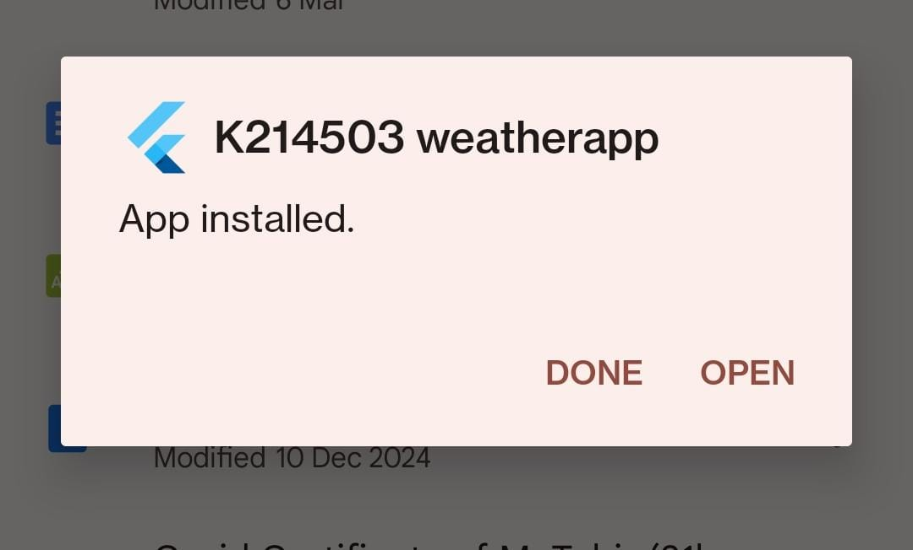
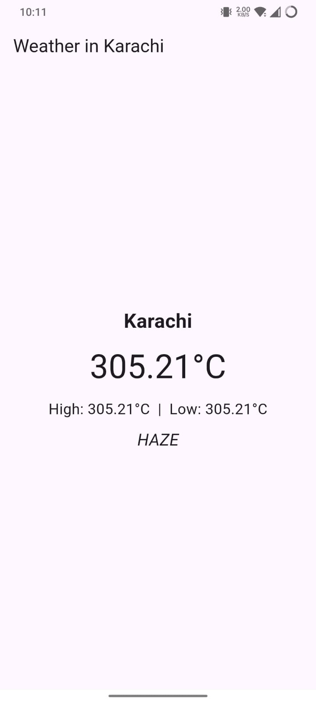

# Muhammad Tahir K214503

# Weather App

A simple Flutter-based weather application that fetches real-time weather data using the OpenWeatherMap API.

## Features
- Fetch current weather conditions
- Display temperature, humidity, and weather descriptions
- Responsive UI for various screen sizes
- Lightweight and fast performance

## Screenshots

Here are some screenshots of the Weather App:




## Installation
### Prerequisites
- Flutter SDK installed ([Download Flutter](https://flutter.dev/docs/get-started/install))
- Android Studio or VS Code with Flutter extension
- OpenWeatherMap API Key ([Get API Key](https://home.openweathermap.org/api_keys))

### Steps
1. Clone the repository:
   ```sh
   git clone https://github.com/muhammad-tahir0312/Weather-App-APK-for-Android.git
   cd Weather-App-APK-for-Android
   ```
2. Install dependencies:
   ```sh
   flutter pub get
   ```
3. Set up API Key:
   - Open `lib/constants.dart` (or wherever API key is stored)
   - Replace `YOUR_API_KEY_HERE` with your OpenWeatherMap API key
4. Run the app:
   ```sh
   flutter run
   ```

## Building APK
To generate a release APK:
```sh
flutter build apk --release
```
The APK will be generated in:
```
build/app/outputs/flutter-apk/app-release.apk
```
Transfer this APK to your Android device and install it.

## Troubleshooting
### API Connection Issue
If you see `SocketException: Failed host lookup`, make sure:
- Your device has internet access
- The API key is valid
- The API URL is correct (`https://api.openweathermap.org/data/2.5/weather`)
- You have added `INTERNET` permission in `AndroidManifest.xml`:
  ```xml
  <uses-permission android:name="android.permission.INTERNET"/>
  ```

## Contributing
Feel free to submit pull requests or report issues.

## License
This project is licensed under the MIT License.
